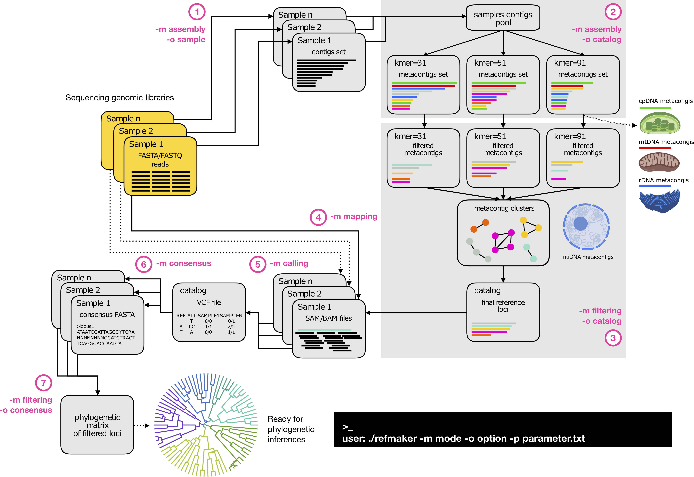

# REFMAKER: create your own reference to target nuclear sequences in shotgun libraries

REFMAKER is a command-line and user-friendly pipeline providing different tools to create nuclear references from genomic assemblies of shotgun libraries.

It needs to be run from a terminal/console, by calling different tasks, called 'modes', along with another parameter corresponding to specific 'options' (see Figure 1). It can be parameterized in order to:
 1. **perform the assembly for each library**
 2. **perform the meta-assembly of these libraries to create a catalog**
 3. **clean the catalog by selecting the nuclear regions, and by removing duplicates from clustering steps**
 4. **map the libraries into the cleaned catalog**
 5. **call the variants**
 6. **get the consensus sequences**
 7. **filter the final sequences to create a phylogenetic matrix**


 <b>REFMAKER flowchart</b>


 
 >**Fig. 1. REFMAKER workflow**.


 **Citation:**
 <br/>Pouchon, C., Boluda, C.G. REFMAKER: make your own reference to target nuclear loci in low coverage genome skimming libraries. Phylogenomic application in Sapotaceae. *in prep.*</b>


 ## Table of contents

 1. [Installation](#1-installation)
 2. [Input files](#2-input-files)
 3. [How to run REFMAKER](#3-how-to-run-refmaker)
 4. [Use of ORTHOSKIM assemblies](#4-use-of-orthoskim-assemblies)


 <!-- toc -->

 ## 1. Installation

 REFMAKER is tested on Unix environment and downloaded from the source code:

 ```
 user$: wget https://github.com/cpouchon/REFMAKER/archive/master.zip
 user$: unzip master.zip
 ```

 REFMAKER is packaged with all required dependencies in a [conda](https://conda.io/projects/conda/en/latest/user-guide/install/index.html) environment, which has to be installed (see https://conda.io/projects/conda/en/latest/user-guide/install/index.html).

 This package is create with the *refmaker-env.yml* file provided:

 ```
 user$: cd ./REFMAKER-master/
 user$: conda env create --prefix /your_path_to_install/refmaker-env --file env/refmaker-env.yml
 ```

 Such package has then to be activated/deactivated when running REFMAKER:

 ```
 user$: conda activate /your_path_to_install/refmaker-env
 user$: (refmaker-env) ./REFMAKER-master/refmaker
 user$: conda deactivate
 ```


 ## 2. Input files

REFMAKER requires a sample file and a parameter file.


 ### 2.1. Parameter (config) file


 Users have to modify the *parameter.txt* file provided before running the pipeline. Default values are set for filtering and assembly steps. Indications about the parameters are given in the section 3.

 ```
user$: nano config_orthoskim.txt
```
```
#REFMAKER (v.1.0) parameter file
#------ global parameters ------------------------------------------------------
TOOLS=~/REFMAKER-master/tools.sh                                                ## [1] path to file with dependencies
RES=~/res_refmaker                                                              ## [2] output directory
THREADS=15                                                                      ## [3] number of threads to use for multithreading steps
#------ demultiplexing ---------------------------------------------------------
DATA=~/path/to/libraries/                                                       ## [4] path to sequencing reads libraries including barcode(s) file(s): *.barcodes
ERROR_RATE=0.17                                                                 ## [5] maximum allowed error rate as value between 0 and 1
READ_QUALITY=10                                                                 ## [6] Trim low-quality bases. If one value is given, only the 3' end is trimmed. If two comma-separated cutoffs are given, the 5' end is trimmed with the first cutoff, the 3' end with the second
MIN_READ_LENGTH=50                                                              ## [7] Discard reads shorter than this length.
BARCODE_LENGTH=6                                                                ## [8] Remove LENGTH bases from second read in a pair
#------ assembly samples -------------------------------------------------------
MEMORY=120                                                                      ## [9] maximal memory used in assembly
KMER=55                                                                         ## [10] k-mer size used in contigs assembly of each library. Single (here 55) or range values (as 21,33,55) allowed. Note: less than 128
SAMPLES_FILE=samples.txt                                                        ## [11] samples file. Specific format required:  (1) sample name with Genus_species_(subsp)_taxid_attributes; (2) path to forward reads; (3) path to reverse reads;
#------ catalog mode with filtering --------------------------------------------
KMER_ARRAY=("31" "51" "71" "91")                                                ## [12] k-mer array sizes used for the catalog assembly. We recommend using different k-mer sizes for this step as a clustering is next done
CD_CLUST=0.8                                                                    ## [13] clustering threshold used in cd-hit (min of 0.80). This can be kept on default value as another clustering step is next done.
CD_LEN=250                                                                      ## [14] minimal length of loci into the catalog
BLAST_SIM=65                                                                    ## [15] blast similarity threshold used to filter out unwanted metacontigs (eg. mtDNA,cpDNA,rDNA,etc)
BLAST_LEN=100                                                                   ## [16] minimal blast mapping length used
EVALUE=0.001                                                                    ## [17] e-values kept for blast search
META_CLUST=0.8                                                                  ## [18] similarity threshold used for the clustering of metacontigs
META_OVERLAP=0.25                                                               ## [19] minimal overlap threshold required for the clustering of metacontigs
#------ mapping and calling modes ----------------------------------------------
MAPPING_QUAL=60                                                                 ## [20] minimal mapping read quality used in BWA
DP=4                                                                            ## [21] minimal base depth to keep a variant
#------ consensus mode with filtering ------------------------------------------
MIN_SEQ=5                                                                       ## [22] minimal number of sequences (samples) required to kept a locus sequence
TRIMMODE=gappyout                                                               ## [23] trimAl mode for the alignment trimming
MAX_SAMP_EXCESS_DEPTH_FREQ=0.5                                                  ## [24] maximal frequency of samples sharing outlier loci in read depth; the whole locus is discarded above this threshold.
MAX_HETERO_BASES_FREQ=0.05                                                      ## [25] maximal heterozygote base frequency allowed by locus by sample; the sequence of the sample is discarded above this threshold for each locus.
MAX_HETERO_SAMP_FREQ=1.0                                                        ## [26] maximal frequency of samples sharing heterozygote bases at each position; the whole locus is discarded above this threshold.
MIN_LOCUS_LEN=200                                                               ## [27] minimal length of loci required in the final matrix
MAX_MISSING_LOCUS_FREQ=0.40                                                     ## [28] maximal missing data allowed by locus by sample; the sequence of the sample is discarded above this threshold for each locus.
MAX_MISSING_SAMPLE_FREQ=0.80                                                    ## [29] maximal missing data allowed by sample in the final alignment; the whole sequences are discarded for this sample in the final matrix above this threshold (eg. taxon with more than 80% of missing data at the end).
MAX_MISSING_LOCUS_FREQ_OUTGROUP=0.80                                            ## [30] maximal missing data allowed by locus by outgroup taxa; the sequence of the outgroup taxon is discarded above this threshold for each locus.
MAX_MISSING_SAMPLE_FREQ_OUTGROUP=0.90                                           ## [31] maximal missing data allowed by outgroup taxa in the final alignment; the whole sequences are discarded for the outgroup taxon in the final matrix above this threshold (eg. taxon with more than 80% of missing data at the end).
POPULATION_FILE=population.txt                                                  ## [32] population file to map samples to population. To specify outgroup taxa in this file, these taxa need to be assigned to the "OUT" population.
MIN_SAMP_FREQ_LOCUS_WITHIN_POP=0.5                                              ## [33] minimal frequency of samples sharing loci within the population. Loci below this threshold within a population are discarded for this population.
MIN_SAMP_FREQ_LOCUS_BETWEEN_POP=0.5                                             ## [34] minimal frequency of population sharing loci. Loci kept within populations are discarded in the final matrix below this threshold.
WINDOW_SIZE=20                                                                  ## [35] sliding window size for errors detection in the alignment (e.g. 20 nt).
WINDOW_PSITE=5                                                                  ## [36] maximal polymorphic sites allowed within the sliding window for errors detection (e.g. 5 nt).


```


### 2.2. Dependencies

The path to all dependencies which are required in REFMAKER must be supplied in the *tools.sh* file.

To retrieve dependencies, once the refmaker-env is activated, please use:

```
user$: conda activate refmaker-env
user$: (refmaker-env) which cutadapt fastqc spades.py makeblastdb blastn cd-hit-est bwa samtools bcftools picard trimal

```

Paths to dependencies are then filled on the *tools.sh* file using the following command:

```
user$: nano tools.sh
```
```
#!/bin/bash

SPADES=/home/charles/.conda/envs/orthoskim-env/bin/spades.py
EXONERATE=/home/charles/.conda/envs/orthoskim-env/bin/exonerate
BLASTDB=/home/charles/.conda/envs/orthoskim-env/bin/makeblastdb
BLASTN=/home/charles/.conda/envs/orthoskim-env/bin/blastn
MAFFT=/home/charles/.conda/envs/orthoskim-env/bin/mafft
TRIMAL=/home/charles/.conda/envs/orthoskim-env/bin/trimal
TBLASTN=/home/charles/.conda/envs/orthoskim-env/bin/tblastn
```


### 2.3. Sample file


A sample file, indicating the libraries used, must be supplied in the **parameter** file (**SAMPLES_FILE**):

```
SAMPLES_FILE=samples.txt                                                        ## [11] samples file. Specific format required:  (1) sample name with Genus_species_(subsp)_taxid_attributes; (2) path to forward reads; (3) path to reverse reads;
```

This tab must contain for each library the following columns :
+ the sample name of the library following *Genus_species_taxid_sampleid_otherids* restriction
+ the file-path to forward reads
+ the file-path reverse reads


```
user$: head ~/REFMALER/resources/listSamples.tab
Veronica_crassifolia_996476_CAR009639_BGN_NFI   /Users/pouchonc/PhyloAlps/CDS/Veronica_crassifolia:996476/BGN_NFIOSW_4_1_CA559ACXX.IND44_clean.fastq.gz /Users/pouchonc/PhyloAlps/CDS/Veronica_crassifolia:996476/BGN_NFIOSW_4_2_CA559ACXX.IND44_clean.fastq.gz
Androsace_helvetica_199610_CLA000520_BGN_ETA    /Users/pouchonc/PhyloAlps/CDS/Androsace_helvetica:199610/BGN_ETAOSW_2_1_C8MR2ACXX.IND13_clean.fastq.gz  /Users/pouchonc/PhyloAlps/CDS/Androsace_helvetica:199610/BGN_ETAOSW_2_2_C8MR2ACXX.IND13_clean.fastq.gz
```


## 3. How to run REFMAKER

REFMAKER uses a command line interface (CLI) that can be accessed through a terminal. Please use the -help (-h) flag to see a description of the main arguments.

```
user$: (refmaker-env) ./refmaker -h
```


After editing the *tools.sh* and *parameter.txt* files (with all required files and formats), REFMAKER is called step by step within the conda environment with a `-m mode`, `-p parameter.txt` and specific `-o option`.


### 3.1. Genomic assemblies by sample

Global assemblies are performed for each library given in the sample file (l.11) by using [SPAdes](http://cab.spbu.ru/software/spades/). The user has to use the `-m assembly -o sample` command to run the assemblies according to the type of library (step 1 in Fig. 1).


`>` **list of commands**

```
user$: (refmaker-env) ./refmaker -m assembly -o sample -p parameter.txt
```


`>` **parameters used**

+ [SPAdes](http://cab.spbu.ru/software/spades/) is run by using different assembly options

```
THREADS=15                                                                      ## [3] number of threads to use for multithreading steps
MEMORY=120                                                                      ## [9] maximal memory used in assembly
KMER=55                                                                         ## [10] k-mer size used in contigs assembly of each library. Single (here 55) or range values (as 21,33,55) allowed. Note: less than 128
SAMPLES_FILE=samples.txt                                                        ## [11] samples file. Specific format required:  (1) sample name with Genus_species_(subsp)_taxid_attributes; (2) path to forward reads; (3) path to reverse reads;
```

`>` **output files**

REFMAKER creates an `assembly/` folder within the working directory including two subdirectories:
+ `/Working_directory/assembly/spades/` with all assemblies produced by SPAdes ordered by libraries (with the given sample names)
+ `/Working_directory/assembly/samples/` with formatted unfiltered assemblies


> **NOTE**: A *assembly_done.log* file is produced during this step with the list of sample libraries that were correctly processed, whereas unprocessed libraries were added into *assembly_error.log* file. This file could be used to remove processed libraries from the initial sample file if the script has to be re-run.


### 3.2. Catalog building

An unfiltered catalog is first build by assembling all sample assemblies into metacontigs by using [SPAdes](http://cab.spbu.ru/software/spades/). This is done with the `-m assembly -o catalog` command.  


`>` **list of commands**

```
user$: (refmaker-env) ./refmaker -m assembly -o catalog -p parameter.txt
```


`>` **parameters used**

+ [SPAdes](http://cab.spbu.ru/software/spades/) is run by using different assembly options

```
THREADS=15                                                                      ## [3] number of threads to use for multithreading steps
MEMORY=120                                                                      ## [9] maximal memory used in assembly
KMER_ARRAY=("31" "51" "71" "91")                                                ## [12] k-mer array sizes used for the catalog assembly. We recommend using different k-mer sizes for this step as a clustering is next done
```

`>` **output files**

A `metassembly/` directory is created within the working directory including subdirectories for each value of kmers specified in the **KMER_ARRAY** of the *parameter.txt* file

> **NOTE**: we recommend to keep different values of kmers here to build the catalog to enhance the number of loci into the catalog as the metacontigs are assembled from the contigs of different taxa and as different clustering are next done to remove the redundant loci.


### 3.2. Catalog filtering

Loci in the catalog are next filtered in order to select the putative nuclear loci and to reduce as many as possible the final number of loci within the catalog by removing redundant and/or heterozygote loci.

This filtering step is done with the `-m filtering -o catalog` command.  


`>` **list of commands**

```
user$: (refmaker-env) ./refmaker -m filtering -o catalog -p parameter.txt
```


`>` **parameters used**

1. [CDHIT](https://sites.google.com/view/cd-hit?pli=1) is first run to select one representative sequence for each *kmer* metassemblies by clustering similar sequences that meet a user-defined similarity threshold. This the level of sequence similarity at which two metacontigs are identified as being homologous.
```
CD_CLUST=0.8                                                                    ## [13] clustering threshold used in cd-hit (min of 0.80).
CD_LEN=250                                                                      ## [14] minimal length of loci into the catalog
```
> **NOTE**: The minimal sequence identity threshold allowed is 0.80. This threshold can be adjust according to the taxonomic diversity of the samples used for the catalog building, in order to cluster heterozygote loci as a single one (eg. more relaxed if the samples are from different genera than for taxa from the same genus).

2. Each of reduced kmer metassemblies are next mapped with blast into databases in order to identify and remove unwanted loci, such as cpDNA, mtDNA or rDNA loci and to keep putative nuclear loci into the catalog.
```
BLAST_SIM=65                                                                    ## [15] blast similarity threshold used to filter out unwanted metacontigs (eg. mtDNA,cpDNA,rDNA,etc)
BLAST_LEN=100                                                                   ## [16] minimal blast mapping length used
EVALUE=0.001                                                                    ## [17] e-values kept for blast search
```
> **NOTE**: Databases implemented in REFMAKER include mtDNA, rDNA and cpDNA sequences for a wide range of taxa. Users can enhanced each database by using sequences for close related species in order to optimize the identification of the unwanted loci. In addition, any other sequences (\*.fasta) can be added into the */your_path_to_install/REFMAKER/resources/filtering_database/* subdirectory to identify and remove other sequences (e.g. fasta sequences of repetitive elements etc).

3. The cleaned kmer metassemblies are next merged and clustered together using blast to reduce the final number of metacontigs into the catalog while accounting for heterozygote loci. A connected graph is created from the blast results between all metacontigs according to their sequence similarity (**META_CLUST**) and their overlap (**META_OVERLAP**). The connection graph is next build by using the MCL algorithm with optimized cluster inflation values. For each cluster, a representative sequence is selected from the length of the metacontigs weighted by their coverage.  
```
META_CLUST=0.8                                                                  ## [18] similarity threshold used for the clustering of metacontigs
META_OVERLAP=0.25                                                               ## [19] minimal overlap threshold required for the clustering of metacontigs
```

`>` **output files**

A `catalog/` directory is created within the working directory including the final catalog (`clean_catalog.fa`) with the list of metassemblies which where filtered out (e.g. those identified as cpDNA) and the clustering graph of loci.

### 3.3. Mapping

The reads of each library provided in the **SAMPLES_FILE** were mapped onto the clean catalog by using [BWA](https://bio-bwa.sourceforge.net) with the `-m mapping` command.
Duplicates reads were removed using the *MarkDuplicates* function in [PICARD](https://broadinstitute.github.io/picard/) tool. Only reads with a mapping quality above **MAPPING_QUAL** were kept thanks to [samtools](http://www.htslib.org).


`>` **list of commands**

```
user$: (refmaker-env) ./refmaker -m mapping -p parameter.txt
```


`>` **parameters used**
```
MAPPING_QUAL=60                                                                 ## [20] minimal mapping read quality used in BWA
```
`>` **output files**

A `mapping/` folder is created within the working directory including the final .bam files for each library. In addition, the read coverage is stored for each library within the `mapping/covs` subdirectory.

### 3.4. Calling

Variant calling is done from the mapping with [bcftools](http://www.htslib.org). Each mapping positions are kept into the final VCF for the consensus. Only SNPs variants, with depth above **DP**, are kept.

This calling step is done with the `-m calling` command.  


`>` **list of commands**

```
user$: (refmaker-env) ./refmaker -m calling -p parameter.txt
```

`>` **parameters used**

```
DP=4                                                                            ## [21] minimal base depth to keep a variant
```
`>` **output files**

A `calling/` directory is created within the working space, including the filtered variant file used for the consensus with all mapping positions (`merge_filtered.bcf`) and a variants file with the SNPs (`merge_filtered_snps.vcf`).


### 3.5. Consensus

Consensus sequences are produced with [bcftools](http://www.htslib.org) for each loci in the catalog using the IUPAC code with the `-m consensus` command. Each locus sequences are then trimmed with [TRIMAL](http://TRIMAL.cgenomics.org/) according to choosen mode **TRIMMODE**.

`>` **list of commands**

```
user$: (refmaker-env) ./refmaker -m consensus -p parameter.txt
```

`>` **parameters used**

```
MIN_SEQ=5                                                                       ## [22] minimal number of sequences (samples) required to kept a locus sequence
TRIMMODE=gappyout                                                               ## [23] trimAl mode for the alignment trimming
```
`>` **output files**

A `consense/` directory is created within the working space,

**TO CONTINUE HERE**


### 3.6. Consensus filtering

Each consensus sequences are finally cleaned to remove as possible errors and/or paralogous sequences for the final phylogenetic matrix.

For this, we first identify outlier loci by library from the read coverage stored during the mapping step and zscores. Loci are removed if the frequency of libraries sharing outlier loci is above **MAX_SAMP_EXCESS_DEPTH_FREQ**.

We next clean the sequences according to the heterozygosity. A maximal frequency of heterozygote bases is set by library and by locus (**MAX_HETERO_BASES_FREQ**). This helps to remove poor alignments with an excess of heterozygote sites. Loci are also filtered according to the maximal proportion of shared polymorphic sites in a locus (**MAX_HETERO_SAMP_FREQ**). This helps to remove potential paralogous loci, as shared heterozygous sites may represent paralogous clusters with erroneous polymorphisms instead of a true heterozygous sites.

We also apply a sliding window approach to detect hyper variable regions, which may represents errors or paralogous loci evolving in a different way, for each library and each locus according to the reference loci. These sequences are removed if the number of polymorphic sites within the window (**WINDOW_SIZE**) is above **WINDOW_PSITE**.

Loci are also filtered according to the populations and the missing data. For this, a population file need to be given to assign samples to populations (**POPULATION_FILE**).

```
head population.txt
Bemangidia_lowry_1243765_123bis_S152_L006_LG5789        OUT
Mimusops_capuronii_1304324_234_S91_L005_RIR307982063    OUT
Capurodendron_madagascariense_1304334_185_S186_L006_SF16962     CAP
Capurodendron_madagascariense_1304334_87_S27_L005_SF27524       CAP
Capurodendron_ankaranense_2800739_1_S36_L006_RAM40-78240        CAP
```
> **NOTE**: outgroups taxa are defined by assigning them to the "OUT" population


A minimum percentage of individuals in a population is required to process a locus for that population (**MIN_SAMP_FREQ_LOCUS_WITHIN_POP**). A minimal proportion of populations is required to consider a locus in final catalog (**MIN_SAMP_FREQ_LOCUS_BETWEEN_POP**).

Concerning the missing data, a maximal proportion of missing data is required to consider a sequence by locus (**MAX_MISSING_LOCUS_FREQ**). A maximal proportion of missing data is also required to consider a sample in the final phylogenetic matrix (**MAX_MISSING_SAMPLE_FREQ**). These parameters are also given for the outgroup taxa, for which these thresholds can be more relaxed (**MAX_MISSING_LOCUS_FREQ_OUTGROUP**,**MAX_MISSING_SAMPLE_FREQ_OUTGROUP**).  


This filtering step is done with `-m filtering -o consensus` command.

`>` **list of commands**

```
user$: (refmaker-env) ./refmaker -m filtering -o consensus -p parameter.txt
```

`>` **parameters used**

```
MAX_SAMP_EXCESS_DEPTH_FREQ=0.5                                                  ## [24] maximal frequency of samples sharing outlier loci in read depth; the whole locus is discarded above this threshold.
MAX_HETERO_BASES_FREQ=0.05                                                      ## [25] maximal heterozygote base frequency allowed by locus by sample; the sequence of the sample is discarded above this threshold for each locus.
MAX_HETERO_SAMP_FREQ=1.0                                                        ## [26] maximal frequency of samples sharing heterozygote bases at each position; the whole locus is discarded above this threshold.
MIN_LOCUS_LEN=200                                                               ## [27] minimal length of loci required in the final matrix
MAX_MISSING_LOCUS_FREQ=0.40                                                     ## [28] maximal missing data allowed by locus by sample; the sequence of the sample is discarded above this threshold for each locus.
MAX_MISSING_SAMPLE_FREQ=0.80                                                    ## [29] maximal missing data allowed by sample in the final alignment; the whole sequences are discarded for this sample in the final matrix above this threshold (eg. taxon with more than 80% of missing data at the end).
MAX_MISSING_LOCUS_FREQ_OUTGROUP=0.80                                            ## [30] maximal missing data allowed by locus by outgroup taxa; the sequence of the outgroup taxon is discarded above this threshold for each locus.
MAX_MISSING_SAMPLE_FREQ_OUTGROUP=0.90                                           ## [31] maximal missing data allowed by outgroup taxa in the final alignment; the whole sequences are discarded for the outgroup taxon in the final matrix above this threshold (eg. taxon with more than 80% of missing data at the end).
POPULATION_FILE=population.txt                                                  ## [32] population file to map samples to population. To specify outgroup taxa in this file, these taxa need to be assigned to the "OUT" population.
MIN_SAMP_FREQ_LOCUS_WITHIN_POP=0.5                                              ## [33] minimal frequency of samples sharing loci within the population. Loci below this threshold within a population are discarded for this population.
MIN_SAMP_FREQ_LOCUS_BETWEEN_POP=0.5                                             ## [34] minimal frequency of population sharing loci. Loci kept within populations are discarded in the final matrix below this threshold.
WINDOW_SIZE=20                                                                  ## [35] sliding window size for errors detection in the alignment (e.g. 20 nt).
WINDOW_PSITE=5                                                                  ## [36] maximal polymorphic sites allowed within the sliding window for errors detection (e.g. 5 nt).
```
`>` **output files**

A `output/` directory is created within the working space, including a concatenated alignment of sequences along with a partition file under a RAxML-style format suitable for phylogenetic inferences.

A total of five are produced:
+ the concatenated alignment
```
head /working directory/output/concatenated.fa
>Capurodendron_madagascariense_1304334_185_S186_L006_SF16962
GGATGAAGAAATTCGAGCGATA-AG--A-ACAACACATGGGAGTTGACCAAGCTTCCAAAAGGGCA-AAACCGAT-GGAGTAAAGTGGGTATACAAGACAAAGAGAAAGGCCAATGGCGATGTTGAGAGGCAC-AGGCGAGACTAGTGGTGAAAGGGTATAGTCAA-GACAC-GCATCGAC-AT-AT-AGGTATTTGCCCC-GTTGTTC-CCTTGAAACTATTCGTTTGATTATTGCTTTGGCAGCCCATAATCATTGGAAGATACATCAAATGGATGTCAAATC-GCATTCTTGAACG-AATTCTT-AG-AGGAG-T-TATGTGGAGCAAC-GTTGGGTTAT-AAGT-AAGGGTGAAGAAGACAAAGTGCTTCGATTGAAGAAGGCTCTTTACGGTTTGAAGCAA-CACCGAGAGCATGGAATTCGAAGATTGACAAGTACTTTCAAGAGAAGAAGTATAT-AAGTGTC-TTATGAGCATGCCCTCTACATCAAAATGCAAGGTGAAAGCATAC------------------TTGATGATTTAGTATTTACGGAAACGATCCTAGCATGTTTGATGAATTCAAAAG-G-GATGGCAAAGGAGTTTGAAATGAC-GACATTGGTCTCATGAGTTACTATCTTGGGATCGAGGTCAAACAA-GTGAAGATGGGATTTTTATATCCCAAGAGGGCTATGCTAAAGAAGTGCTCAAAAGGTTCAACATGGATGATGCTAATCCGGTTGGAACACCAATGGAA-GTGGAGTCAAAAT-ACCAAGCAA-ATGGAGGAGAGAAGGTAGATT-TACACTTTTCAAAAGCTTGGTTGGAAGTTTGAGAT-C-TGACATGCACAAGAC-GGATATTCTTTATTC-GTTGG-ATCATTAGTCGATTTTTGGAGGAGCCGACAACAACGCATTTCAAAATGGGAAAGAG-ATACTTCGCTACATCAAAGGGACGATTGGGTATGG-CTTTCCTATGTCTCTTCTAGCAATTTTGAT-TTGTTGGTTATTGTGATAGTGATTGGAGTAGTGA-TTGGATGATCGGAAGAGCACTA-GGGGTTTGTATTTTTTATTGGTGAAA-GGCGTTCACATGGAT
```
+ the partition file for the different loci
```
head /working directory/output/concatenated.partitions
DNA, part1 = 1-4487
DNA, part2 = 4488-4759
DNA, part3 = 4760-5405
DNA, part4 = 5406-9898
DNA, part5 = 9899-14462
```
+ the partition assignment file with the loci names
```
head /working directory/output/concatenated.info
1	4487	NODE_93_length_4520_cov_20.647137_k31	part1
4488	4759	NODE_432_length_281_cov_19.176000_k31	part2
4760	5405	NODE_288_length_649_cov_3.053422_k51	part3
5406	9898	NODE_95_length_4497_cov_8.260442_k31	part4
9899	14462	NODE_77_length_4794_cov_21.618728_k31	part5
```
+ the final amount of missing data by taxa
```
head /working directory/output/concatenated.missing
Bemangidia_lowry_1243765_123bis_S152_L006_LG5789	0.73
Bemangidia_spnov_2800767_122_S150_L006_Razakamalala3976	0.68
Mimusops_capuronii_1304324_234_S91_L005_RIR307982063	0.38
Mimusops_sp_2800713_101_S33_L005_LG6027	0.47
Mimusops_sp_2800713_281_S103_L005_RIR3071-82055	0.45
```
+ some summary statistics of the loci
```
head /working directory/output/summary.txt
Name	Seqs	Sites	Infor	Invar	Amb	Miss	MissAll
part1	22	4487	21	4458	2.02	2.56	10.9
part2	19	272	15	232	1.0	9.54	30.38
part3	13	646	0	641	1.19	6.24	52.07
part4	19	4493	55	4378	0.7	8.86	29.69
part5	19	4564	11	4542	0.23	0.28	21.11
```

+ the log file of the filtering
```
tail /working directory/output/concatenated.log
remaining loci: 89/303
[INFOS]: computing final output fasta files
[INFOS]: final matrix
loci number: 89
samples: 24
length (bp): 145595
```

## 4. Use of ORTHOSKIM assemblies

REFMAKER can be used along to [ORTHOSKIM](https://github.com/cpouchon/ORTHOSKIM), which is designed to capture target genes within the shotgun libraries, as both method start with an assembly step of each library.

To do this, the assembly fasta files produced in ORTHOSKIM (either the `Assembly/Sample/filtered/*.fa` or `Assembly/Sample/unfiltered/*.fa`) can be pasted directly within the `assembly/samples/` folder of the working directory.
